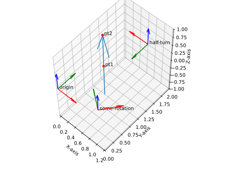

.. _homogeneous-points:

Homogeneous Points
==================

The class :class:`.PointHomogeneous` is used to represent points in n-dimensional space.

A 3D point with coordinates :math:`(x, y, z)` in Eucledian space :math:`\mathbb{R}^3`
can be represented as a 4D point in homogeneous space :math:`\mathbb{R}^4`
as :math:`(w, x, y, z)`.

3D points can be embedded into dual quaternion space in the following way:

.. math::

    \mathbf{q} = (w, x, y, z) \in \mathbb{R}^4
    \rightarrow \mathbf{q'} = (w, 0, 0, 0, 0, x, y, z) \in SE(3)

where :math:`SE(3)` is the special Euclidean group of rigid body transformations
in 3D space.

How dual quaternions act on points can be found in :ref:`dq_action_on_point`.

.. _normalized-lines:

Normalized Lines
================

The class :class:`.NormalizedLine` is used to represent lines.

A line in 3D space can be represented using Plücker coordinates.
These are six-dimensional vectors :math:`\mathbf{l}=(g_0, g_1, g_2, g_3, g_4, g_5)`.
The line's direction is :math:`\mathbf{g}=(g_0,g_1,g_2)`, its moment vector
:math:`\overline{\mathbf{g}} = (g_3,g_4,g_5)` is obtained as

.. math::

    \overline{\mathbf{g}} = \mathbf{q} \times \mathbf{g} = - \mathbf{g} \times \mathbf{q}

where :math:`\mathbf{q}` is an arbitrary point on the line. Plücker coordinates
fulfill the Plücker condition

.. math::

    \mathbf{g}^T\cdot\overline{\mathbf{g}} = 0

Normalized line then corresponds to Plücker coordinates with the condition, that

.. math::

    \mathbf{||g||} = 1

i.e. the direction vector is normalized. More on Plücker
coordinates can be found in :footcite:t:`Pottmann2001`.

Lines can be embedded into dual quaternion space in the following way:

.. math::

    \mathbf{l} = (g_0, g_1, g_2, g_3, g_4, g_5) \in \mathbb{R}^6
    \rightarrow \mathbf{l'} = (0, g_0, g_1, g_2, 0, -g_3, -g_4, -g_5) \in SE(3)

How dual quaternions act on lines can be found in :ref:`dq_action_on_line`.

Dual quaternions that correspond to lines can be interpreted as the `half-turn` transformations,
i.e. transformations that rotate the origin by 180 degrees around the line. The following
code snippet plots the half-turn transformation corresponding to a line in 3D space.

.. testcode:: [half_turn_example]

    from rational_linkages import Plotter, DualQuaternion, NormalizedLine, PointHomogeneous
    from copy import deepcopy

    pt1 = PointHomogeneous([1, 0.3, 1, 0])  # w = 1, x = 0.3, y = 1, z = 0
    pt2 = PointHomogeneous([1, 0.3, 1, 1])  # w = 1, x = 0.3, y = 1, z = 1
    l = NormalizedLine.from_two_points(pt1, pt2)

    dq1 = DualQuaternion(l.line2dq_array())

    dq2 = deepcopy(dq1)  # alter the rotation part of the dual quaternion to get some other transformation
    dq2[0] = 2

    p = Plotter(arrows_length=0.5, backend='matplotlib')
    p.plot(l)
    p.plot(pt1, label='pt1', color='red')
    p.plot(pt2, label='pt2', color='red')

    p.plot(dq1, label='half-turn')
    p.plot(dq2, label='some-rotation')
    p.show()

.. testcleanup:: [half_turn_example]

    del Plotter, DualQuaternion, NormalizedLine, PointHomogeneous, deepcopy
    del pt1, pt2, l, dq1, dq2, p

We can additionally see that if we alter the zero element of :code:`dq1` to get :code:`dq2`, we get a transformation
that corresponds to some rotation around the line, but not a half-turn transformation anymore.

    Half-turn transformation corresponding to a line in 3D space

**References:**

.. footbibliography::