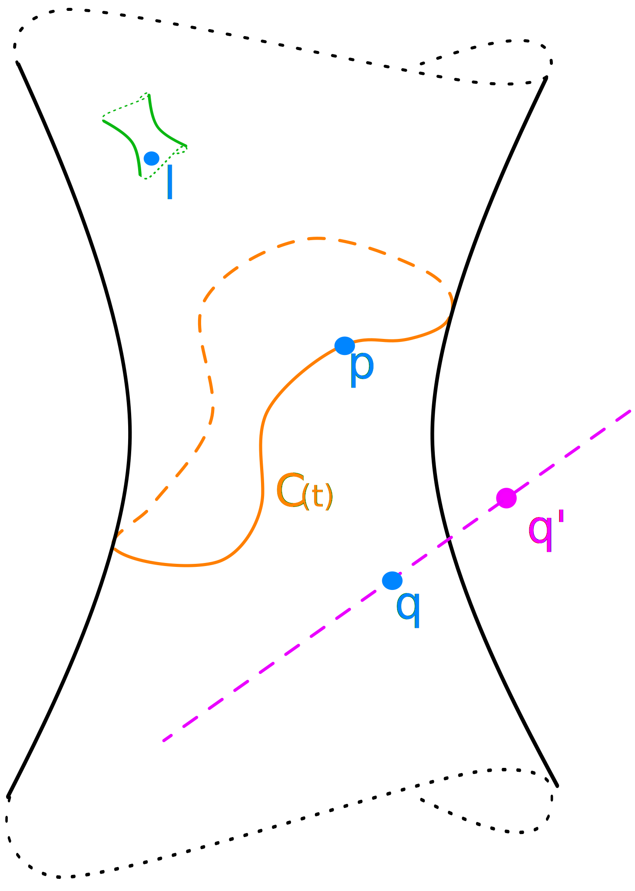

.. _studys-kinematics:

Study's Kinematics
==================

This page briefly summarizes the key concepts that
`Eduard Study <https://en.wikipedia.org/wiki/Eduard_Study>`_
(1862 - 1930) introduced in the field of kinematics
by him :footcite:p:`study1901geometrie`. It brings
a model of minimal dimensionality to describe the
Special Euclidean group SE(3), the group of proper
rigid body motions :footcite:p:`Selig2005`.

This model is closely related to :ref:`dual-quaternions`.

The tuple :math:`\mathbf{p} = (p_0 : p_1 : p_2 : p_3 : p_4 : p_5 : p_6 : p_7)` of
homogeneous coordinates in the 7-dimensional projective space :math:`\mathbb{PR}^7`
is also known as the **Study parameters** or the **Study's vector**, and it lies on the
Study quadric.

.. _study-quadric:

Study Quadric
-------------

The Study quadric is a 6-dimensional
quadric in the 7-dimensional projective space :math:`\mathbb{PR}^7` defined by the
equation, also known as the **Study condition**:

.. math::
    p_0 p_4 + p_1 p_5 + p_2 p_6 + p_3 p_7 = 0

    Visualization of Study quadric; regular points (dual quaternions) are in blue,
    pink point :math:`\mathbf{q}'` is out of
    the quadric but can be back-projected as :math:`\mathbf{q}`.
    :math:`C(t)` is a motion curve going through
    point :math:`\mathbf{p}`. Point :math:`\mathbf{l}` is dual quaternion
    representing line
    on the Plücker quadric (green), that is also contained in the Study quadric.

A point :math:`\mathbf{p}` lies on the Study's quadric if and only if its elements
satisfy the Study condition.

There are elements of the Study's quadric that are not representing a ridig body
transformation. They lie in a 3-space on the quadric that fulfills the equation:

.. math::
    p_0^2 + p_1^2 + p_2^2 + p_3^2 = 0

This 3-dimensional space is also called the exceptional
generator or the null quadric.

**References:**

.. footbibliography::