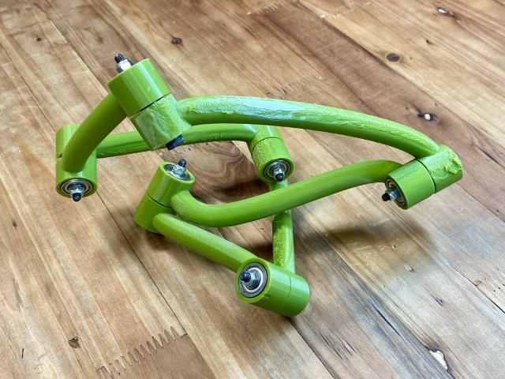
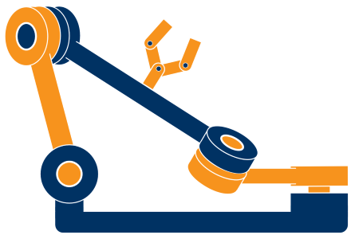

.. Rational Linkages documentation master file, created by
   sphinx-quickstart on Fri Sep  8 13:45:57 2023.

.. include:: refs-weblinks.rst

.. |image1| image:: /figures/r4.JPEG
   :width: 24%
.. |image2| image:: /figures/r6li.JPEG
   :width: 24%
.. |image3| image:: /figures/r6hp.JPEG
   :width: 24%

.. |binder_badge| image:: https://mybinder.org/badge_logo.svg
   :target: https://mybinder.org/v2/gh/hucik14/rational-linkages/HEAD?labpath=docs%2Fsource%2Ftutorials%2Fsynthesis_bennett.ipynb

.. |blankline| raw:: html

    

Rational Linkages |image-logo|
==============================

.. image:: https://img.shields.io/badge/Github-mirror_%26_issues-_?style=social&logo=github
   :target: https://github.com/hucik14/rational-linkages
   :alt: GitHub Mirror

.. image:: https://img.shields.io/badge/Git_UIBK-repository-_?style=social&logo=gitlab
   :target: https://git.uibk.ac.at/geometrie-vermessung/rational-linkages
   :alt: GitLab (self-managed)

.. image:: https://img.shields.io/pypi/v/rational-linkages.svg
   :target: https://pypi.org/project/rational-linkages/
   :alt: PyPI

.. image:: https://zenodo.org/badge/DOI/10.1007/978-3-031-64057-5_27.svg
   :target: https://doi.org/10.1007/978-3-031-64057-5_27
   :alt: DOI

|blankline|

.. image:: https://img.shields.io/github/issues/hucik14/rational-linkages
   :target: https://github.com/hucik14/rational-linkages/issues
   :alt: GitHub issues

.. image:: https://img.shields.io/badge/maintenance-actively--developed-brightgreen.svg
   :target: https://git.uibk.ac.at/geometrie-vermessung/rational-linkages/-/network/main
   :alt: Maintenance

.. image:: https://mybinder.org/badge_logo.svg
   :target: https://mybinder.org/v2/gh/hucik14/rational-linkages/HEAD?labpath=docs%2Fsource%2Ftutorials%2Fsynthesis_bennett.ipynb

Welcome to the Rational Linkages package documentation, which serves as a reference for
the provided tools. This package is a collection of functions for the synthesis,
analysis, design, and rapid prototyping of the single-loop rational linkages,
allowing one to
create 3D-printable collision-free mechanisms synthesised for a given task
(set of poses), as in the images below.

|image1| |image2| |image3| |image4|

The package is developed at the Unit of Geometry and Surveying,
University of Innsbruck, Austria. The source code is available
as `Gitlab repository`_ hosted by UIBK. The *installation
instructions* can be found in the :ref:`installation manual<installation>`.
STL files of some mechanisms may be found as `models on Printables.com`_.

Since the self-hosted repository (Gitlab, University of Innsbruck) does not allow external users to create issues,
please, use the `package mirror`_
hosted on Github for submitting **issues** and **feature requests**.

For installation-free try-out, run live example of the package in your browser using
the **Binder** service. Click on the badge to start
the Jupyter Notebook: |binder_badge|

In case of other questions or contributions, please, email the author at:
daniel.huczala@uibk.ac.at

Main Features:
--------------

- Synthesis of single-loop rational linkages for a given task - set of poses or points,
- search of full-cycle collision-free design of the linkages,
- design of 3D-printable mechanisms,
- basic control algorithms for velocity motion planning,
- interactive motion design.

.. toctree::
   :maxdepth: 2
   :caption: Contents:

   general
   tutorials
   background-math
   modules

Indices and Tables:
-------------------

* :ref:`genindex`
* :ref:`modindex`
* :ref:`search`

Authors
-------

The package is developed by the Unit of Geometry and Surveying, University of Innsbruck,
Austria. Namely, the following people contributed to the development:

- Daniel Huczala (author, maintainer)
- Hans-Peter Schröcker (supervisor, contributor)
- Martin Pfurner (contributor)
- Daren A. Thimm (contributor)

Citing the Package
------------------

If you use the Rational Linkages package in your research, please, cite it as follows:

Huczala, D., Siegele, J., Thimm, D.A., Pfurner, M., Schröcker, HP. (2024).
Rational Linkages: From Poses to 3D-Printed Prototypes.
In: Lenarčič, J., Husty, M. (eds) Advances in Robot Kinematics 2024. ARK 2024.
Springer Proceedings in Advanced Robotics, vol 31. Springer, Cham.
DOI: `10.1007/978-3-031-64057-5_27 <https://doi.org/10.1007/978-3-031-64057-5_27>`_.

.. code-block:: text

   @inproceedings{huczala2024linkages,
       title={Rational Linkages: From Poses to 3D-printed Prototypes},
       author={Daniel Huczala and Johannes Siegele and Daren A. Thimm and Martin Pfurner and Hans-Peter Schröcker},
       year={2024},
       booktitle={Advances in Robot Kinematics 2024. ARK 2024},
       publisher={Springer International Publishing},
       url={https://doi.org/10.1007/978-3-031-64057-5_27},
       doi={10.1007/978-3-031-64057-5_27},
   }

**Preprint** available on Arxiv:
`https://arxiv.org/abs/2403.00558 <https://arxiv.org/abs/2403.00558>`_.

Acknowledgements
================

.. figure:: figures/eu.png
   :align: left
   :alt: EU Flag
   :width: 250px

:sub:`Funded by the European Union. Views and opinions expressed are however those of
the author(s) only and do not necessarily reflect those of the European Union
or the European Research Executive Agency (REA). Neither the European Union
nor the granting authority can be held responsible for them.`

We would like to thank our colleagues outside the Unit of Geometry and Surveying, who
contributed to the development of the package and helped with implementation of
their algorithms and suggestions. These people are namely:

- **Johannes Gerstmayr**, University of Innsbruck, Austria, for the help with creating the interface to his `Exudyn`_ :footcite:p:`Gerstmayr2023` software. More on this in section :ref:`exudyn_info`.
- **Georg Nawratil**, Technical University of Vienna, Austria,
- and **Zijia Li**, Chinese Academy of Sciences, China, for their help with the implementation of the Combinatorial Search Algorithm of collision-free linkages :footcite:p:`Li2020`. More on this in section :ref:`combinatorial_search`.
- **Johannes Siegele**, Austrian Academy of Sciences, Austria, for his help with the implementation of the algorithm for motion interpolation of 4 poses. More on this in section :ref:`interpolation_background`.
- **Severinas Zube**, Vilnius University, Lithuania, for his help with implementing the algorithm for motion interpolation of 3D points :footcite:p:`Zube2018`. More on this in section :ref:`interpolation_examples`.
- **Soohyun Kim**, Pusan National University, Korea, for her help with the implementation of the Gauss-Legendre curves :footcite:p:`Moon2023` to represent curved links.

**References**

.. footbibliography::