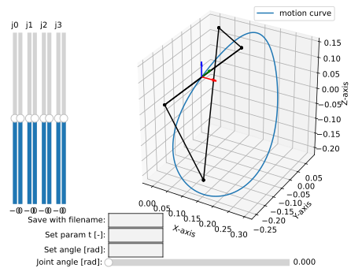

ARK 2024 paper - extended information
=====================================

This page contains the extended information for the paper submitted to conference ARK
2024, Lublijana, Slovenia, under the title: **Rational Linkages: from Poses to
3D-printed Prototypes**

Bennett mechanism example
-------------------------

A Bennett mechanism was synthesized by Brunnthaler et al. [#brunnthaler2005new]_.
It perform the motion :math:`C(t)` given byt the following equation

.. math::
   C(t) =
   \begin{bmatrix}
      0  \\
      22134 + 39870 t + 4440 t^2 \\
      -42966+9927t+16428 t^2 \\
      -115878-73843t-37296 t^2 \\
      0 \\
      -7812-14586t-1332 t^2 \\
      6510-1473t-2664 t^2 \\
      -3906-1881t-1332 t^2 \\
   \end{bmatrix}

This equation serves as the input for the following script.

.. code-block:: python
        :caption: Bennett mechanism example

        from RationalCurve import RationalCurve
        from RationalMechanism import RationalMechanism
        from FactorizationProvider import FactorizationProvider
        from Plotter import Plotter
        import numpy as np

        coeffs = np.array([[0, 0, 0],
                           [4440, 39870, 22134],
                           [16428, 9927, -42966],
                           [-37296,-73843,-115878],
                           [0, 0, 0],
                           [-1332, -14586, -7812],
                           [-2664, -1473, 6510],
                           [-1332, -1881, -3906]])

        # define a rational curve object
        c = RationalCurve.from_coeffs(coeffs)

        # factorize the curve
        factors = FactorizationProvider().factorize_motion_curve(c)

        # define a mechanism object
        m = RationalMechanism(factors)

        # define a plotter object, set interactive mode and number of discrete steps
        # to plot the curve
        p = Plotter(interactive=True, steps=500)

        # plot the mechanism
        p.plot(m, show_tool=True)
        p.show()

The curve :math:`C(t)` is of degree 2 in the variable :math:`t`, and can be factorized
in the following form:

.. math::
    C(t) = (t - h_1)(t - h_2) = (t - k_1)(t - k_2)

The Dual Quaternions that relate to the revolute joints of the Bennett linkage were
obtained using the FactorizationProvider class. The resulting Study parameters are:

.. math::
    h_1 =
    \begin{bmatrix}
        -1.38983921 \\
        0.68767732 \\
        -0.71589104  \\
        0.70107044 \\
        0 \\
        0.279825759 \\
        0.233347361 \\
        -0.03619970 \\
    \end{bmatrix}
    h_2 =
    \begin{bmatrix}
        -0.45127753 \\
        -1.18920251  \\
        0.02617346  \\
        -1.06457999 \\
        0 \\
        -0.205980947 \\
        0.0051919116 \\
        0.230221262 \\
    \end{bmatrix}
    k_1 =
    \begin{bmatrix}
        -0.45127753 \\
        -1.37336934 \\
        -0.65524381  \\
        0.4824214 \\
        0 \\
        -0.11647403 \\
        0.242442406 \\
        -0.00228634 \\
    \end{bmatrix}
    k_2 =
    \begin{bmatrix}
        -1.38983921  \\
        0.87184415 \\
        -0.03447376 \\
        -0.84593095 \\
        0 \\
        0.190318846 \\
        -0.00390313 \\
        0.1963079 \\
    \end{bmatrix}

The resulting mechanism is plotted unsing the Plotter class. The resulting plot is
shown in the figure below.

**References**

.. [#brunnthaler2005new] Katrin Brunnthaler, Hans-Peter Schroecker, and Manfred Husty.
    A new method for the synthesis of bennett mechanisms. *International Workshop on
    Computational Kinematics, 2005.*
    (https://geometrie.uibk.ac.at/cms/datastore/husty/BennettSynthesis-CK53-final.pdf)

