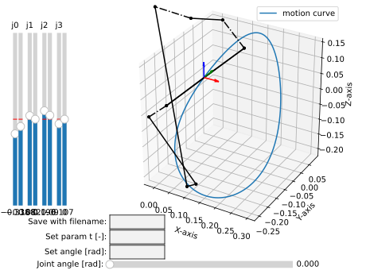
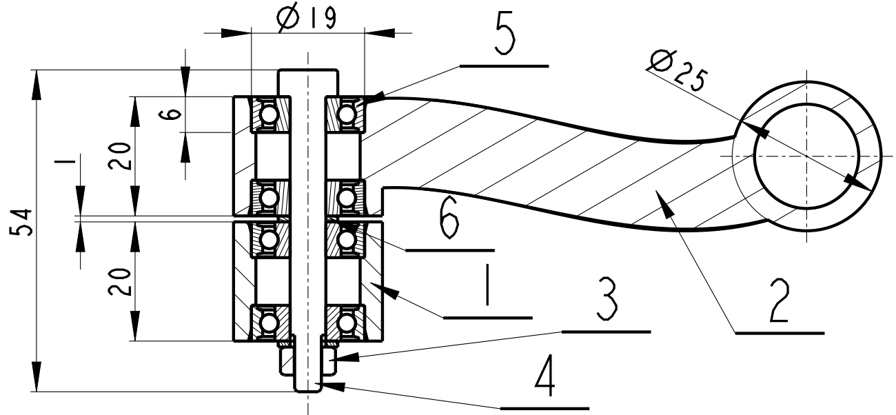
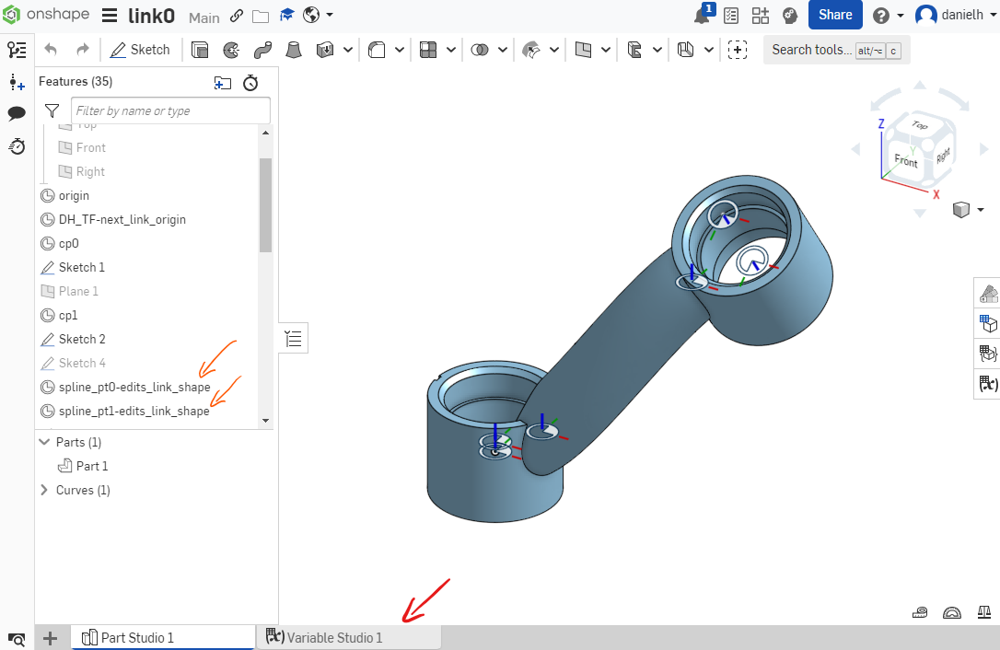
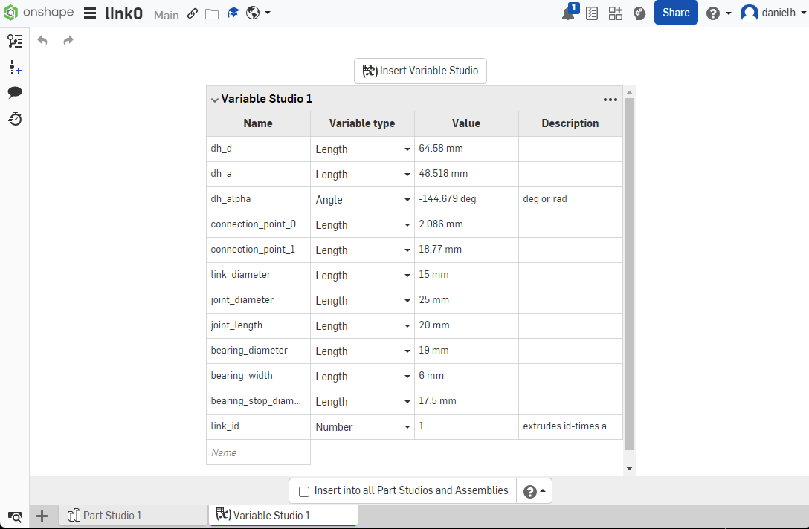
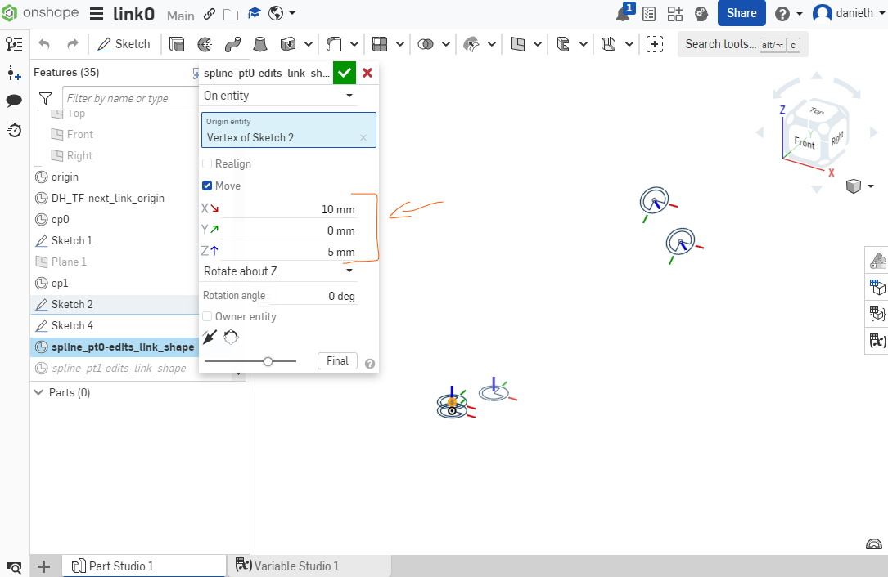

.. _ark2024extended:

ARK 2024 Paper - Extended Information
=====================================

This page contains the extended information for the paper submitted to conference ARK
2024, Lublijana, Slovenia, under the title: *Rational Linkages: From Poses to
3D-printed Prototypes*

Please, make sure to **install** the package before running the following examples, as
described in the :ref:`installation<installation>` section.

Bennett mechanism example
-------------------------

A Bennett mechanism was synthesized by :footcite:t:`Brunnthaler2005`.
It performs the motion :math:`C(t)` given byt the following equation

.. math::
   C(t) =
   \begin{bmatrix}
      0  \\
      22134 + 39870 t + 4440 t^2 \\
      -42966+9927t+16428 t^2 \\
      -115878-73843t-37296 t^2 \\
      0 \\
      -7812-14586t-1332 t^2 \\
      6510-1473t-2664 t^2 \\
      -3906-1881t-1332 t^2 \\
   \end{bmatrix}

This equation serves as the input for the following script.

.. testcode::

        # Bennett mechanism example

        from rational_linkages import RationalCurve, RationalMechanism, FactorizationProvider, Plotter
        import numpy as np

        coeffs = np.array([[0, 0, 0],
                           [4440, 39870, 22134],
                           [16428, 9927, -42966],
                           [-37296,-73843,-115878],
                           [0, 0, 0],
                           [-1332, -14586, -7812],
                           [-2664, -1473, 6510],
                           [-1332, -1881, -3906]])

        # define a rational curve object
        c = RationalCurve.from_coeffs(coeffs)

        # factorize the curve
        factors = c.factorize()

        # define a mechanism object
        m = RationalMechanism(factors)

        # define a plotter object, set interactive mode and number of discrete steps
        # to plot the curve
        p = Plotter(interactive=True, steps=500, arrows_length=0.05)

        # plot the mechanism
        p.plot(m, show_tool=True)
        p.show()

.. testoutput::
    :hide:
    :options: +ELLIPSIS

    ...

The curve :math:`C(t)` is of degree 2 in the variable :math:`t`, and can be factorized
in the following form:

.. math::
    C(t) = (t - h_1)(t - h_2) = (t - k_1)(t - k_2)

The Dual Quaternions that relate to the revolute joints of the Bennett linkage were
obtained using the FactorizationProvider class. The resulting Study parameters are:

.. math::
    h_1 =
    \begin{bmatrix}
        -1.38983921 \\
        0.68767732 \\
        -0.71589104  \\
        0.70107044 \\
        0 \\
        0.279825759 \\
        0.233347361 \\
        -0.03619970 \\
    \end{bmatrix}
    h_2 =
    \begin{bmatrix}
        -0.45127753 \\
        -1.18920251  \\
        0.02617346  \\
        -1.06457999 \\
        0 \\
        -0.205980947 \\
        0.0051919116 \\
        0.230221262 \\
    \end{bmatrix}
    k_1 =
    \begin{bmatrix}
        -0.45127753 \\
        -1.37336934 \\
        -0.65524381  \\
        0.4824214 \\
        0 \\
        -0.11647403 \\
        0.242442406 \\
        -0.00228634 \\
    \end{bmatrix}
    k_2 =
    \begin{bmatrix}
        -1.38983921  \\
        0.87184415 \\
        -0.03447376 \\
        -0.84593095 \\
        0 \\
        0.190318846 \\
        -0.00390313 \\
        0.1963079 \\
    \end{bmatrix}

The resulting mechanism is plotted unsing the Plotter class. The resulting plot is
shown in the figure below.

.. figure:: figures/ark_bennett_home.svg
    :width: 500 px
    :align: center
    :alt: Visualization of the synthesized Bennett mechanism

**Physical modelling of Bennett mechanism**

Since the default line model cannot be directly used for 3D printing, because the joint
segments are too small. Therefore, the sliders on the left side of the plotter window
can be used to control the placement of the physical conneting points on a joint-axis.
An example is shown in Figure below.

When a user is satisfied with the placement of the connecting points, the mechanism can
be saved to a file using the "Save with filename:" textbox, filling the filename and
pressing Enter button on the keyboard. Eventually, it is possible to save the mechanism
using the method :meth:`.RationalMechanism.save` in Python console. Then, the mechanism
can be loaded and checked for collisions using the script below.

If there are no collisions, the output in the console will write "No collisions found."
If there are collisions, it will return list of parameter :math:`t` values, where the
collisions happen. This value can be passed to the plotting window at the textbox
:code:`Set param t [-]`.

.. code-block:: python

        # IMPORTANT NOTE:
        #
        # due to Sphinx's doctest extension constraints, the following
        # code is NOT automatically tested. In case of error, please
        # report this issue to the developers.

        # Loading a mechanism, collision checking, and design generation

        from rational_linkages import RationalMechanism
        from rational_linkages.models import bennett_ark24

        # on Windows, the script has to be run inside the if __name__ == '__main__'
        # so the parallel processing can be used
        if __name__ == '__main__':
            # load the mechanism
            m = bennett_ark24()

            # check for collisions
            m.collision_check(parallel=True)

            # generate the design
            dh, cp = m.get_design(unit='deg', scale=200)

This last line of the script generates the design of the mechanism with the following
output:

.. code-block:: text
        :caption: Design generation output

        Link 0: d = 64.580219, a = 48.517961, alpha = -144.679172
        cp_0 = 2.085621, cp_1 = 18.770367
        ---
        Link 1: d = -0.000000, a = 83.708761, alpha = -94.053746
        cp_0 = -2.229633, cp_1 = -0.650840
        ---
        Link 2: d = -0.000000, a = 48.517961, alpha = -144.679172
        cp_0 = -21.650840, cp_1 = 38.167707
        ---
        Link 3: d = -0.000000, a = 83.708761, alpha = -94.053746
        cp_0 = 59.167707, cp_1 = -83.494598

The argument :code:`unit='deg'` specifies, that :math:`\alpha_i` angle is given in
degrees. The argument :code:`scale=200` specifies the length parameters :math:`d_i`,
:math:`a_i` and connection point parameters :math:`cp_{0i}, cp_{1i}` will be scaled by
200, which assures that the mechanism has dimensions as shown in milimeters, suitable
for 3D-printing. The unspecified arguments using line :code:`dh, cp = m.get_design()`
would have output in radians and without scaling, for example:

.. code-block:: text
        :caption: Exemple of default output

        Link 0: d = 0.322901, a = 0.242590, alpha = -2.525128
        cp_0 = 10.457928, cp_1 = 10.541352

The method :meth:`.RationalMechanism.get_design` has additional optional arguments,
which are by default set :code:`joint_length=20` and :code:`washer_length=1`. These are
dimensions in milimeters that are used in the pre-prepared CAD model. The drawing of
the default joint is shown in the figure below.

The balloons correspond to this list:

    1. Link :math:`i`
    2. Link :math:`i+1`
    3. Stop nut ISO 7040, size M5
    4. Screw ISO 7379, size D6-40mm M5
    5. Bearings 626 (6x19x6 mm), used 4x
    6. Washers DIN 988, inner diameter 6 mm and width 1 mm, used 2x

The model parts of the Bennett CAD models are available on Onshape, a cloud-based CAD
software freely available, where they can be viewed, exported, and downloaded (in
multiple formats including STL):

    * **Assembly:** https://cad.onshape.com/documents/5f75155fed80647eaafd88a7/w/3241929bd4f562af39728512/e/d7c5a5901bca93e09e0343ed
    * link0: https://cad.onshape.com/documents/b11a23adebf5c90d5fc39c93/w/d4838bec6fdac9d34ecc6e9d/e/d95a88ff126fc64262ad9eb7
    * link1: https://cad.onshape.com/documents/52d41f9f7095713853e32d51/w/4627cc38143db535625106b7/e/be17ec1bb14ec47a006cb0a8
    * link2: https://cad.onshape.com/documents/62f222602d8ec4869987a979/w/accbe18fa04b21a223ff36b7/e/487ac189d26dbc73b2be82de
    * link3: https://cad.onshape.com/documents/506cfc6c8c855458b05cf7bf/w/9684caf53f6a7519df3fe806/e/f95cb90348488cb4c58cd964

The models are opened for copying and editing for Onshape users. Use free account or
free education plan for academia: https://www.onshape.com/en/education/

Any link can be edited with newly calculated parameters. Use *"Variable Studio 1"* tab
in the model as show via **red arrow** in the figure below. I might happen that the link
curve is not suitable for the new parameters (it has a unnaturally curved shape or not
renders at all). In that case, adjust two curve points by editing their coordinates
by double clink on the features *"spline_pt0-edits_link_shape"* and
*"spline_pt1-edits_link_shape"* as shown via **orange arrows** in the figure below.

Editing in Variable studio:

Editing so-called Mate Connectors which determine the shape of the link-curve:

**References**

.. footbibliography::

