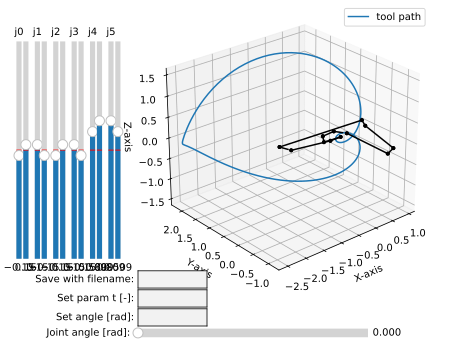

.. _comb_search_tutorial:

Combinatorial search of collision-free mechanism
================================================

A simple example of how to use the combinatorial search to find a collision-free
mechanism, adapting the algorithm by :footcite:t:`Li2020`. More details on the
algorithm can be found also in the docs :ref:`combinatorial_search`.

The basic outline can be run as follows:

.. code-block:: python

    # IMPORTANT NOTE:
    #
    # due to time-consuming nature of the search, the following code
    # is NOT automatically tested. In case of error, please report
    # this issue to the developers.

    from rational_linkages import (DualQuaternion, MotionFactorization,
                                   RationalMechanism, Plotter)

    if __name__ == '__main__':
        h1 = DualQuaternion.as_rational([0, 1, 0, 0, 0, 0, 0, 0])
        h2 = DualQuaternion.as_rational([0, 0, 3, 0, 0, 0, 0, 1])
        h3 = DualQuaternion.as_rational([0, 1, 1, 0, 0, 0, 0, -2])

        f1 = MotionFactorization([h1, h2, h3])

        # find factorizations
        factorizations = f1.factorize()

        # create mechanism
        m = RationalMechanism(factorizations)
        m.collision_free_optimization(max_iters=10,
                                      min_joint_segment_length=0.3)

        # plot mechanism
        myplt = Plotter(interactive=True, steps=200, arrows_length=0.2, joint_range_lim=3.0)
        myplt.plot(m, show_tool=False)
        myplt.show()

This will perform full search and tries to find a collision-free design of the given
mechanism. The result will be found at iteration :code:`4`, for links shifting combination
:code:`(0, 0, 0, 1, 1, 0)`, and links-joint shifting combination
:code:`(-1, 1, 1, -1, -1, 1, 1, -1, -1, 1, 1, -1)`. The output can be seen
in the following figure:

    Collising-free mechanism found by combinatorial search.

For advanced search and testing, the method
:meth:`.RationalMechanism.collision_free_optimization()` accepts along the default
arguments also these keyword arguments:

    - :code:`start_iteration`: int
    - :code:`end_iteration`: int
    - :code:`combinations_links`: list
    - :code:`combinations_joints`: list

and they can be set as follows:

.. testcode::

    from rational_linkages import (DualQuaternion, MotionFactorization,
                                   RationalMechanism, Plotter)

    h1 = DualQuaternion.as_rational([0, 1, 0, 0, 0, 0, 0, 0])
    h2 = DualQuaternion.as_rational([0, 0, 3, 0, 0, 0, 0, 1])
    h3 = DualQuaternion.as_rational([0, 1, 1, 0, 0, 0, 0, -2])

    f1 = MotionFactorization([h1, h2, h3])

    # find factorizations
    factorizations = f1.factorize()

    # create mechanism
    m = RationalMechanism(factorizations)
    m.collision_free_optimization(max_iters=10,
                                  min_joint_segment_length=0.3,
                                  start_iteration=4,
                                  combinations_links=[(0, 0, 0, 1, 1, 0)],
                                  combinations_joints=[(-1, 1, 1, -1, -1, 1, 1, -1, -1, 1, 1, -1)])

    # plot mechanism
    myplt = Plotter(interactive=True, steps=200, arrows_length=0.2, joint_range_lim=3.0)
    myplt.plot(m, show_tool=False)
    myplt.show()

.. testoutput::
    :hide:
    :options: +ELLIPSIS

    ...

**References:**

.. footbibliography::

