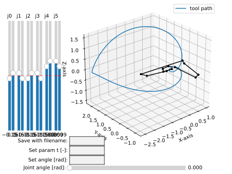

.. _comb_search_tutorial:

Combinatorial search of collision-free mechanism
================================================

A simple example of how to use the combinatorial search to find a collision-free
mechanism, adapting the algorithm by :footcite:t:`Li2020`. More details on the
algorithm can be found also in the docs :ref:`combinatorial_search`.

The basic outline can be run as follows:

.. literalinclude:: /examples_not_tested/d_t_combinatorial_search_full.py
    :language: python

This will perform full search and tries to find a collision-free design of the given
mechanism. The result will be found at iteration :code:`4`, for links shifting combination
:code:`(0, 0, 0, 1, 1, 0)`, and links-joint shifting combination
:code:`(-1, 1, 1, -1, -1, 1, 1, -1, -1, 1, 1, -1)`. The output can be seen
in the following figure:

    Collising-free mechanism found by combinatorial search.

For advanced search and testing, the method
:meth:`.RationalMechanism.collision_free_optimization()` accepts along the default
arguments also these keyword arguments:

    - :code:`start_iteration`: int
    - :code:`end_iteration`: int
    - :code:`combinations_links`: list
    - :code:`combinations_joints`: list

and they can be set as follows:

.. literalinclude:: /examples/d_t_comb_search_found.py
    :language: python

**References:**

.. footbibliography::

