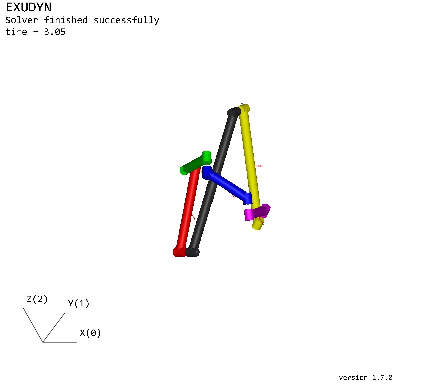
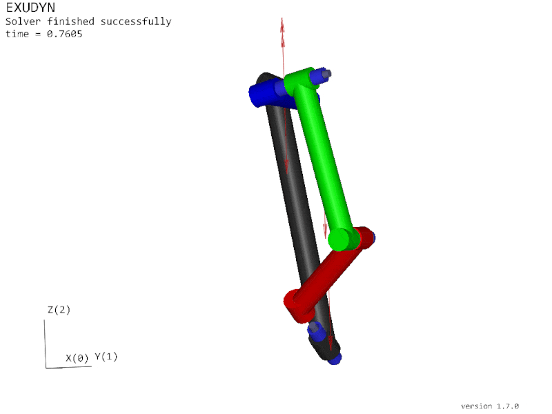

.. _exudyn_info:

Dynamics Simulations - Exudyn Integration
=========================================

.. include:: ../refs-weblinks.rst

The package provides an interface to the `Exudyn`_
flexible multibody dynamics simulation library by :footcite:t:`Gerstmayr2023`,
developed at the Department of Mechatronics, University of Innsbruck, Austria.
Source code is available at https://github.com/jgerstmayr/EXUDYN

Exudyn **is NOT** listed in the *Rational Linkages* dependencies, since it does not
support Python 3.12 yet, and it is not used in the background. To install Exudyn,
please follow the instructions in the `Exudyn documentation`_, the usual way with
pip is:

.. code-block:: bash

    pip install exudyn

Exudyn is lightweight, written in C++, and provides a Python interface
for easy usage and integration. The library supports large deformations
and handles can handle contact and friction problems.
It offers a variety of joints and forces for comprehensive simulation
capabilities. Its flexibility makes it suitable for a broad spectrum
of dynamic simulations.

**This interface to Exudyn is a work-in-progress and probably won't work for all linkages.** Please,
report any issues or suggestions. It might be necessary to adjust the simulation
parameters from the following code to fit the specific mechanism. Additionally, please
see the `Exudyn documentation`_ for more information on the simulation parameters.

The class :class:`.ExudynAnalysis` gathers the necessary geometric and kinematic
properties of a linkage, that can be used to create a simulation model in Exudyn.
Use the following code to create an Exudyn model from a linkage:

.. testcode::

    from rational_linkages import ExudynAnalysis
    from rational_linkages.models import collisions_free_6r, bennett_ark24
    from exudyn.utilities import *

    # choose 4-bar or 6-bar mechanism
    mechanism_case = '4r'
    # mechanism_case = '6r'

    if __name__ == '__main__':
        # define initial parameters for simulation
        match mechanism_case:
            case '4r':
                m = bennett_ark24()
                number_of_links = 4

                # exudyn parameters
                w = 0.06  # width of link
                simulation_time = 1.5
                torque_load = [0, 0, 50]

                # last joint is "generic" with these constraints
                constrained_axes = [1, 1, 0, 0, 0, 0]
            case '6r':
                m = collisions_free_6r()
                number_of_links = 6

                # exudyn parameters
                w = 0.1  # width of link
                simulation_time = 5
                torque_load = [6000, 0, 0]

                # last joint is "generic" with these constraints
                constrained_axes = [1, 1, 1, 0, 1, 0]

        # get parameters from rational_linkages mechanism model
        (links_pts, links_lengths, body_dim, links_masses_pts, joint_axes,
         rel_links_pts) = ExudynAnalysis().get_exudyn_params(m, link_radius=w)

        ###################################################################################
        # EXUDYN PART #####################################################################

        useGraphics = True
        g = [0, 0, -9.81]  # gravity
        colors = [color4red, color4green, color4blue, color4magenta, color4yellow]
        SC = exu.SystemContainer()
        mbs = SC.AddSystem()

        inertias = [InertiaCuboid(density=5000, sideLengths=body_dim[i])
                    for i in range(number_of_links)]

        # GRAPIHCS BODIES
        # ground link
        gGround0 = GraphicsDataRigidLink(p0=links_pts[0][0], p1=links_pts[0][1],
                                         axis0=joint_axes[-1], axis1=joint_axes[0],
                                         radius=[0.5 * w, 0.5 * w],
                                         thickness=w, width=[1.2 * w, 1.2 * w],
                                         color=color4darkgrey)
        graphics_bodies = [gGround0]

        # other links
        for i in range(1, number_of_links):
            graphics_body = GraphicsDataRigidLink(
                p0=rel_links_pts[i][0],
                p1=rel_links_pts[i][1],
                axis0=joint_axes[i - 1],
                axis1=joint_axes[i],
                radius=[0.5 * w, 0.5 * w],
                thickness=w,
                width=[1.2 * w, 1.2 * w],
                color=colors[i - 1]
            )
            graphics_bodies.append(graphics_body)

        # RIGID BODIES
        # ground body
        oGround = mbs.AddObject(
            ObjectGround(visualization=VObjectGround(graphicsData=[gGround0])))
        bodies = [oGround]

        # other links
        for i in range(1, number_of_links):
            body = mbs.CreateRigidBody(
                inertia=inertias[i],
                referencePosition=links_masses_pts[i],
                gravity=g,
                graphicsDataList=[graphics_bodies[i]]
            )
            bodies.append(body)

        # REVOLUTE JOINTS
        for i in range(number_of_links - 1):
            mbs.CreateRevoluteJoint(
                bodyNumbers=[bodies[i], bodies[i + 1]],
                position=links_pts[i][1],
                axis=joint_axes[i],
                useGlobalFrame=True,
                axisRadius=0.02,
                axisLength=0.14
            )

        # TORQUE
        mBody = mbs.AddMarker(
            MarkerNodeRigid(nodeNumber=mbs.GetObject(bodies[-1])['nodeNumber']))
        mbs.AddLoad(Torque(markerNumber=mBody, loadVector=torque_load))

        last_joint_frame = ComputeOrthonormalBasis(joint_axes[-1])

        mbs.CreateGenericJoint(bodyNumbers=[bodies[-1], bodies[0]],
                               position=links_pts[-1][1],
                               rotationMatrixAxes=last_joint_frame,
                               constrainedAxes=constrained_axes,
                               useGlobalFrame=True,
                               axesRadius=0.02,
                               axesLength=0.14)

        mbs.Assemble()

        # simulation parameters:
        simulationSettings = exu.SimulationSettings()

        simulationSettings.timeIntegration.numberOfSteps = 1000
        simulationSettings.timeIntegration.endTime = simulation_time
        simulationSettings.timeIntegration.verboseMode = 1

        simulationSettings.linearSolverSettings.ignoreSingularJacobian = True
        simulationSettings.linearSolverType = exu.LinearSolverType.EigenDense

        mbs.ComputeSystemDegreeOfFreedom(verbose=True, useSVD=True)
        # mbs.systemData.Info()

        if useGraphics:
            exu.StartRenderer()
            print('wait')
            mbs.WaitForUserToContinue()

        mbs.SolveDynamic(simulationSettings)#, showHints=True, showCausingItems=True)

        # stop graphics
        if useGraphics:
            SC.WaitForRenderEngineStopFlag()
            exu.StopRenderer()

        # visualize results after simulation:
        mbs.SolutionViewer()

.. footbibliography::