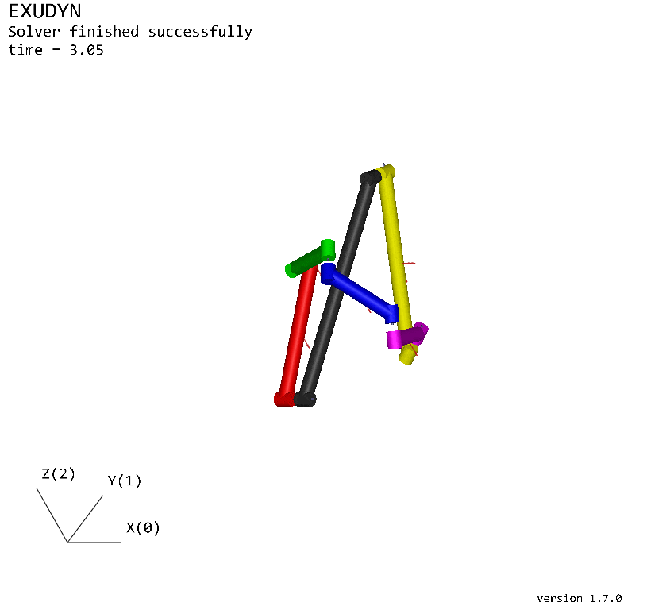
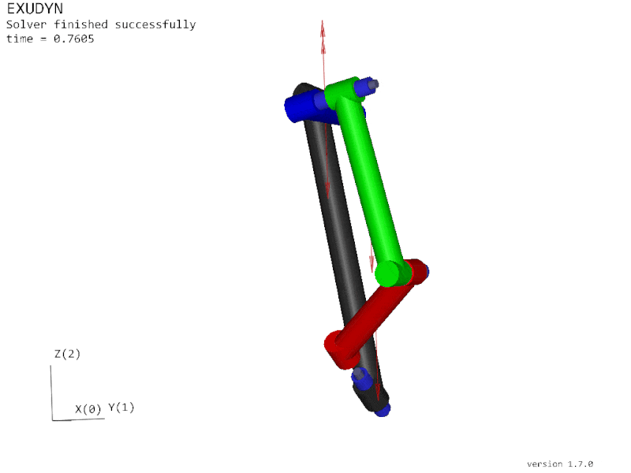

.. _exudyn_info:

Dynamics Simulations - Exudyn Integration
=========================================

.. include:: ../refs-weblinks.rst

The package provides an interface to the `Exudyn`_
flexible multibody dynamics simulation library by :footcite:t:`Gerstmayr2023`,
developed at the Department of Mechatronics, University of Innsbruck, Austria.
Source code is available at https://github.com/jgerstmayr/EXUDYN

We would like to thank prof. Johannes Gerstmayr for his help with the integration.

Exudyn is in the optional dependencies of the *Rational Linkages* dependencies. To install Exudyn,
please follow the instructions in the `Exudyn documentation`_ or get this way:

.. code-block:: bash

    pip install rational_linkages[cad]

Exudyn is lightweight, written in C++, and provides a Python interface
for easy usage and integration. The library supports large deformations
and handles can handle contact and friction problems.
It offers a variety of joints and forces for comprehensive simulation
capabilities. Its flexibility makes it suitable for a broad spectrum
of dynamic simulations.

**This interface to Exudyn is a work-in-progress and probably won't work for all linkages.** Please,
report any issues or suggestions. It might be necessary to adjust the simulation
parameters from the following code to fit the specific mechanism. Additionally, please
see the `Exudyn documentation`_ for more information on the simulation parameters.

The class :class:`.ExudynAnalysis` gathers the necessary geometric and kinematic
properties of a linkage, that can be used to create a simulation model in Exudyn.
Use the following code to create an Exudyn model from a linkage:

.. literalinclude:: /examples_not_tested/d_exudyn_4r.py
    :language: python

**References:**

.. footbibliography::