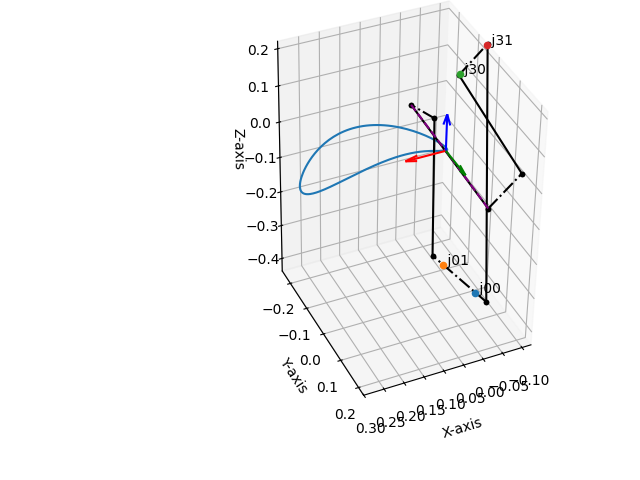

Mechanism in the World Frame
============================

This tutorial will guide you through the process of designing a mechanism with end-effector (tool)
in the world frame.

Default (home) configuration
^^^^^^^^^^^^^^^^^^^^^^^^^^^^

By default, the tool frame corresponds to identity pose, i.e., the end-effector is at the origin of the world frame
in its home configuration.

See :ref:`alternative_tools` for more details how differently specify a tool frame.

Home configuration is given when parameter :math:`t=\infty` (or number like :math:`t=10^{12}` or higher in practice).
To design a mechanism with a tool, the home configuration can be used in combination with the joint axes. The method
:meth:`.RationalMechanism.get_design()` can be used to generate the needed design parameters, as it returns
the Denavit--Hartenberg parameters, axes-line connection parameters for prepared Onshape model (see
:ref:`physical_modeling`), and the list of point pairs that define the axes. These point pairs are scaled
to match the size of the links specified by the method :meth:`.RationalMechanism.get_design()` arguments.
The point pairs are a convenient way
to assembly your mechanism correctly. See the example below:

.. testcode:: [assembling-mechanism-with-tool]

    from rational_linkages import Plotter
    from rational_linkages.models import bennett_ark24

    m = bennett_ark24()
    dh, design_params, design_points = m.get_design(return_point_homogeneous=True,
                                                    pretty_print=False)

    # obtain points on joint0
    base_joint0_pts = design_points[0]

    # obtain points on the last joint (joint3)
    base_joint3_pts = design_points[-1]

    p = Plotter(m, arrows_length=0.1, backend='matplotlib')
    # plot the first joint points
    for i, pt in enumerate(base_joint0_pts):
        p.plot(pt, label=f'j0{i}')

    # plot the last joint points
    for i, pt in enumerate(base_joint3_pts):
        p.plot(pt, label=f'j3{i}')
    p.show()

    m.export_single_mesh(add_tool_frame=True,
                         file_name='mesh_bennett_ark24.stl')

.. testcleanup:: [assembling-mechanism-with-tool]

        del Plotter, bennett_ark24, m, dh, design_params, design_points, p, base_joint0_pts, base_joint3_pts, i, pt

The output will look similar like in the figure below, where the points belonging
to joints 0 and 3  are plotted
in the world frame, which is coincident with the tool frame at this (home) configuration. As the first and last
joints are always static, they can be used to determine the position of the mechanism base link in the world frame
once you start assembling the CAD model.

It can be useful to observe the visualization of the mechanism. For this purpose, the mechanism
can be meshed and exported as STL file. The method :meth:`.RationalMechanism.export_single_mesh()`
was used for this purpose. It accepts arguments for size of the joints and links cylinders, and also can
add the tool link and frame meshes. The Python libraries :mod:`trimesh` and :mod:`manifold3d` are
required.

See the following figure describing how the related attributes of the :class:`.RationalMechanism` class are
programmed in the background. The reason for this implementation is that the mechanisms can have more than 4 joints,
and therefore the number of joints and links is variable.

The joint axes :math:`\mathbf{h}_i` and :math:`\mathbf{k}_i` correspond to the dual quaterionions defined in
the :ref:`motions_and_factorization` section. Physically, these mechanism create :class:`.LineSegment` objects, i.e.
a polyline that connects the physical realization of the joint-link segments. For 4R mechanism, there are
8 segments :math:`\mathbf{s}_{0..7}`. The attribute :code:`RationalMechanism.segments` then keeps the naming
as base link is :math:`\mathbf{l}_{00}`, first joint of right factorization is :math:`\mathbf{j}_{00}`, while
the first joint of the left factorization is :math:`\mathbf{j}_{10}`, etc. The last link is :math:`\mathbf{l}_{12}`.

Changing base frame of the mechanism
^^^^^^^^^^^^^^^^^^^^^^^^^^^^^^^^^^^^

For plotting, it is possible to change the base frame of the mechanism.
See the example in :ref:`changing_bases_interpolation`
in the quadratic interpolation of 5 points how to do it.