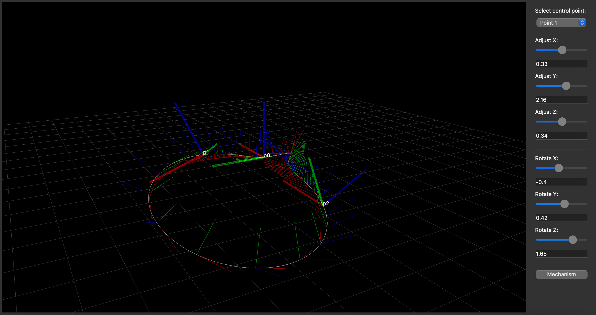

Motion Designer
===============

The :class:`.MotionDesigner()` is an interactive tool for designing rational motions (and
corresponding linkages) for a given task, i.e., a set of poses or points.

It is a part of the Rational Linkages package, using Qt6 backend for the GUI. There are four methods
supported for designing rational motions. They correspond to the :ref:`interpolation_examples` method.

    - ``quadratic_from_poses`` -- interpolates a sef of 3 poses yielding a quadratic motion curve (4-bar linkage)
    - ``cubic_from_poses`` -- interpolates a set of 4 poses yielding a cubic motion curve (6-bar linkage)
    - ``quadratic_from_points`` -- interpolates a set of 5 points yielding a quadratic motion curve (4-bar linkage)
    - ``cubic_from_points`` -- interpolates a set of 7 points yielding a cubic motion curve (6-bar linkage)

In the code, use it as follows:

.. testcode:: [motion_designer_example]

    from rational_linkages import MotionDesigner

    designer = MotionDesigner(method='quadratic_from_poses')
    designer.show()

.. testcleanup:: [motion_designer_example]

    del designer
    del MotionDesigner

This will produce an interactive window where you can alter the given poses or points using the sliders
or text boxes. It is possible to synthesize and visualize multiple mechanisms. However, sometimes the
parameterization of the motion curve is not 'nice', i.e., the motion curve visualization is not smooth.
To avoid this, copy the output data and insert to a new :class:`.Plotter` instance with a higher number
of ``steps``.

After closing the window, chosen parameters will be printed out, so they can be used in
:ref:`interpolation_examples`, or used as an input for a new :class:`.MotionDesigner` instance (see the
docstring of the class for more details).
