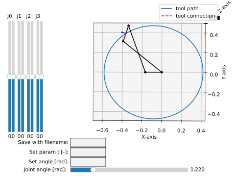
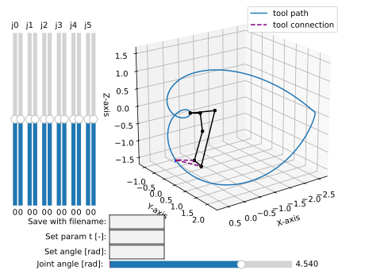

.. _factorization_tutorial:

Motion Factorization
====================

This tutorial demonstrates how to use the method
:meth:`.MotionFactorization.factorize()`
and related class :class:`.FactorizationProvider` to factorize a rational motion,
as described by :footcite:t:`Hegeds2012` and :footcite:p:`Hegeds2013`.

The theory behind the motion factorization is described in section
:ref:`motions_and_factorization`.

For better **computational stability**, it is recommended (but not necessary) to use
rational dual quaternions, constructed using the method
:meth:`.DualQuaternion.as_rational()`, which will take the input and applies Sympy's
`Rational` function to each element of the give 8-vector array.

Factorization of planar 4-bar
-----------------------------

.. testcode::

    from rational_linkages import (DualQuaternion, MotionFactorization,
                                   RationalMechanism, Plotter)

    f1 = MotionFactorization([DualQuaternion.as_rational([0, 0, 0, 1, 0, 0, 0, 0]),
                              DualQuaternion.as_rational([0, 0, 0, 2, 0, 0, -1, 0])])

    # find factorizations
    factorizations = f1.factorize()

    # create mechanism
    m = RationalMechanism(factorizations, tool='mid_of_last_link')

    # plot mechanism
    myplt = Plotter(interactive=True, steps=200, arrows_length=0.05)
    myplt.plot(m, show_tool=True)
    myplt.show()

.. testoutput::
    :hide:
    :options: +ELLIPSIS

    ...

Which results in the following plot:

    Factorized 4-bar mechanism

Factorization of spatial 6R mechanism
-------------------------------------

.. testcode::

    from rational_linkages import (DualQuaternion, MotionFactorization, RationalMechanism,
                                   Plotter)

    h1 = DualQuaternion.as_rational([0, 1, 0, 0, 0, 0, 0, 0])
    h2 = DualQuaternion.as_rational([0, 0, 3, 0, 0, 0, 0, 1])
    h3 = DualQuaternion.as_rational([0, 1, 1, 0, 0, 0, 0, -2])

    f1 = MotionFactorization([h1, h2, h3])

    # find factorizations
    factorizations = f1.factorize()

    # create mechanism
    m = RationalMechanism(factorizations)

    # plot mechanism
    myplt = Plotter(interactive=True, steps=200, arrows_length=0.2)
    myplt.plot(m, show_tool=True)
    myplt.show()

.. testoutput::
    :hide:
    :options: +ELLIPSIS

    ...

Which results in the following plot:

    Factorized 6-bar mechanism

**References:**

.. footbibliography::