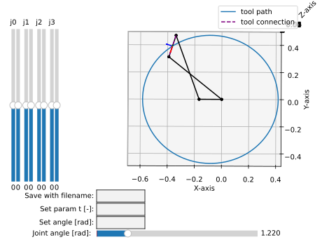
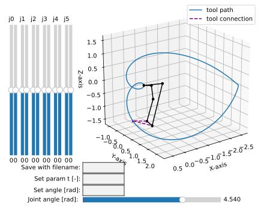

.. _factorization_tutorial:

Motion Factorization
====================

This tutorial demonstrates how to use the method
:meth:`.MotionFactorization.factorize()`
and related class :class:`rational_linkages.FactorizationProvider` to factorize a rational motion,
as described by :footcite:t:`Hegeds2012` and :footcite:p:`Hegeds2013`.

The theory behind the motion factorization is described in section
:ref:`motions_and_factorization`.

For better **computational stability**, it is recommended (but not necessary) to use
rational dual quaternions, constructed using the method
:meth:`.DualQuaternion.as_rational()`, which will take the input and applies Sympy's
``Rational`` function to each element of the give 8-vector array.

Factorization of planar 4-bar
-----------------------------

.. literalinclude:: /examples/d_t_motion_factorization_4bar.py
    :language: python

Which results in the following plot:

    Factorized 4-bar mechanism

Factorization of spatial 6R mechanism
-------------------------------------

.. literalinclude:: /examples/d_t_motion_factorization_6r.py
    :language: python

Which results in the following plot:

    Factorized 6-bar mechanism

**References:**

.. footbibliography::