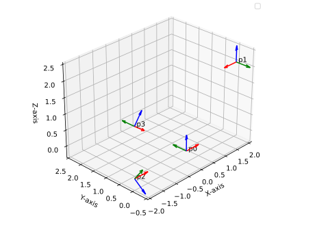
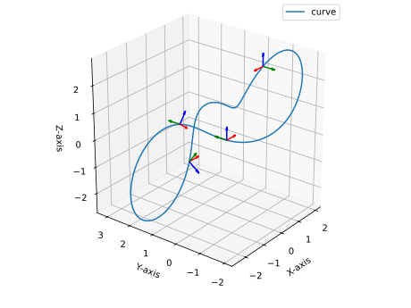
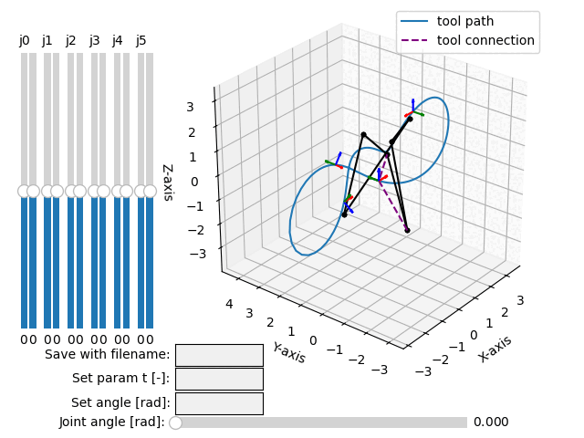
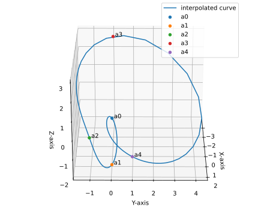

.. _interpolation_examples:

Motion Interpolation
====================

The package implements the method described in the paper by :footcite:t:`Hegeds2015`
for 4 poses interpolation using cubic rational function, that yields
6-revolute linkages, and the method by :footcite:t:`Brunnthaler2005` for
3 poses interpolation using quadratic rational functions, that yields 4-revolute
linkage, i.e. the Bennett mechanism.

The previous methods interpolate poses (trasformations) in 3D space. The method by
:footcite:t:`Zube2018` is interpolating 5 or 7 points in 3D space, and yields
a quadratic or cubic rational function that represents a 4R (Bennett) or
6R linkage.

All methods have some geometrical constraints, and therefore the interpolation is not
always possible. The package is also providing a method for 2 poses
interpolation method that yields a spatial Bennett mechanism (4-revolute linkage).

For motion interpolation, the input can be both, :class:`.DualQuaternion` objects
or :class:`.TransfMatrix` objects.

Quadratic interpolation of 3 poses
----------------------------------

The following example applies the method by :footcite:t:`Brunnthaler2005`.

.. testcode:: [motion_interp_example1]

    # Quadratic interpolation of 3 poses

    from rational_linkages import DualQuaternion, Plotter, MotionInterpolation

    p0 = DualQuaternion([0, 17, -33, -89, 0, -6, 5, -3])
    p1 = DualQuaternion([0, 84, -21, -287, 0, -30, 3, -9])
    p2 = DualQuaternion([0, 10, 37, -84, 0, -3, -6, -3])

    c = MotionInterpolation.interpolate([p0, p1, p2])

    plt = Plotter(steps=500, arrows_length=0.05)
    plt.plot(c, interval='closed')

    for i, pose in enumerate([p0, p1, p2]):
        plt.plot(pose, label='p{}'.format(i+1))
    plt.show()

.. testcleanup:: [motion_interp_example1]

    del plt, p0, p1, p2, c
    del DualQuaternion, Plotter, MotionInterpolation

Cubic interpolation of 4 poses
------------------------------

This method does not work for any 4 poses - some geometrical constraints must be
met. Please, refer to the original paper (:footcite:t:`Hegeds2015`) for more details,
or see simplified description in :ref:`interpolation_background`.

Here is presented an example of cubic interpolation of 4 poses.

.. testcode:: [motion_interp_example2]

    # Cubic interpolation of 4 poses

    from rational_linkages import DualQuaternion, Plotter, MotionInterpolation, RationalMechanism

    # 4 poses
    p0 = DualQuaternion()  # identity
    p1 = DualQuaternion.as_rational([0, 0, 0, 1, 1, 0, 1, 0])
    p2 = DualQuaternion.as_rational([1, 2, 0, 0, -2, 1, 0, 0])
    p3 = DualQuaternion.as_rational([3, 0, 1, 0, 1, 0, -3, 0])

    # obtain the interpolated motion curve
    c = MotionInterpolation.interpolate([p0, p1, p2, p3])

    # factorize the motion curve
    fs = c.factorize()

    # create a mechanism from the factorization
    m = RationalMechanism(fs)

    # create an interactive plotter object, with 500 descrete steps
    # for the input rational curves, and arrows scaled to 0.05 length
    myplt = Plotter(mechanism=m, steps=500, arrows_length=0.5)

    # plot the poses
    for pose in [p0, p1, p2, p3]:
        myplt.plot(pose)

    # show the plot
    myplt.show()

.. testcleanup:: [motion_interp_example2]

    del myplt, p0, p1, p2, p3, c, fs, m
    del DualQuaternion, Plotter, MotionInterpolation
    del RationalMechanism

The input are 4 dual quaternions, :math:`p_0, p_1, p_2, p_3`, and the output is a
parametric rational curve :math:`C(t)` that interpolates the poses. Keep in mind that
:math:`p_0` is the identity.

    4 given poses.

The curve equation is then of the form:

.. math::

   C(t) =
        \begin{bmatrix}
        t^3 - 0.4375t^2 - 0.171875t, \\
        0.25t^2 - 0.25t - 0.078125, \\
        0.3125t^2 - 0.078125t - 0.0390625, \\
        -0.0625t^2 + 0.109375t - 0.0390625, \\
        0.28125t, \\
        0.125t^2 - 0.125t - 0.0390625, \\
        -t^2 + 0.34375t + 0.078125, \\
        0
        \end{bmatrix}

And can be plotted as shown in the following figure.

    Curve :math:`C(t)` that interpolates the poses.

The curve is then factorized, and the resulting mechanism is plotted.

    6R mechanism whose tool frame (purple link) follows the curve :math:`C(t)`.

Quadratic interpolation of 2 poses
----------------------------------

The following example partially applies the method by :footcite:t:`Brunnthaler2005`,
but interpolates only 2 poses. The 3rd pose is set first set to the identity. If this
fails, the 3rd pose is than obtained by setting a random rotation and optimizing the
position of the 3rd pose to achieve the shortest curve-path length.

.. testcode:: [motion_interp_example3]
    :skipif: skip_this_doctest == True

    # Quadratic interpolation of 2 poses with an optimized 3rd pose

    from rational_linkages import (Plotter, MotionInterpolation,
                                   TransfMatrix, RationalMechanism)

    p0 = TransfMatrix()  # identity
    p1 = TransfMatrix.from_rpy_xyz([0, 0, 90], [0.15, -0.2, 0.2], unit='deg')

    interpolated_curve = MotionInterpolation.interpolate([p0, p1])
    m = RationalMechanism(interpolated_curve.factorize())

    p = Plotter(mechanism=m, steps=500, arrows_length=0.05)
    p.plot(p0)
    p.plot(p1)

    p.plot(interpolated_curve, interval='closed')

    p.show()

.. testoutput:: [motion_interp_example3]
    :hide:
    :options: +ELLIPSIS

    ...

.. testcleanup:: [motion_interp_example3]
    :skipif: skip_this_doctest == True

    del p, p0, p1, interpolated_curve, m
    del Plotter, MotionInterpolation, TransfMatrix, RationalMechanism

Quadratic interpolation of 5 points
-----------------------------------

The following example applies the method by :footcite:t:`Zube2018`. The result is
non-monic polynomial, i.e. the factorized mechanism will be transformed by a static
transformation.

.. testcode:: [motion_interp_example4]

    # Quadratic interpolation of 5 points

    from rational_linkages import (Plotter, MotionInterpolation, PointHomogeneous,
                                   DualQuaternion, RationalMechanism)

    # Define 5 points in PR3 space (1st coordinate is projective, then x, y, z)
    a0 = PointHomogeneous([1, 0, 0, 0])
    a1 = PointHomogeneous([1, 1, 0, -2])
    a2 = PointHomogeneous([1, 2, -1, 0])
    a3 = PointHomogeneous([1, -3, 0, 3])
    a4 = PointHomogeneous([1, 2, 1, -1])
    points = [a0, a1, a2, a3, a4]

    interpolated_curve = MotionInterpolation.interpolate(points)
    m = RationalMechanism(interpolated_curve.factorize())

    # due to non-monic solution, to transform the given points and plot them in mechanism
    # path, get static transform 'rebase' and uncomment the line in for loop bellow
    rebase = DualQuaternion(interpolated_curve.evaluate(1e12)).normalize()

    p = Plotter(mechanism=m, steps=500, arrows_length=0.5)

    p.plot(interpolated_curve, interval='closed')

    for i, pt in enumerate(points):
        # pt = rebase.inv().act(pt)  # uncomment to plot the points in the mechanism path
        p.plot(pt, label=f'a{i}')

    p.show()

.. testcleanup:: [motion_interp_example4]

    del p, points, interpolated_curve, m, rebase
    del Plotter, MotionInterpolation, PointHomogeneous, DualQuaternion
    del RationalMechanism

The resulting curve is plotted in the following figure.

    Rational quadratic curve that interpolates 5 points.

Cubic interpolation of 7 points
-------------------------------

The follwoing example applies the extended method by :footcite:t:`Zube2018`
and interpolates 7 points (3D points) with a cubic rational motion. The result is
again non-monic polynomial, i.e. the factorized mechanism will be transformed
by a static transformation.

.. testcode:: [motion_interp_example5]

    # Cubic interpolation of 7 points

    from rational_linkages import (Plotter, MotionInterpolation, PointHomogeneous,
                                   DualQuaternion, RationalMechanism)

    # Define 5 points in PR3 space (1st coordinate is projective, then x, y, z)
    a0 = PointHomogeneous([1, 0, 0, 0])
    a1 = PointHomogeneous([1, 1, 0, -2])
    a2 = PointHomogeneous([1, 2, -1, 0])
    a3 = PointHomogeneous([1, -3, 0, 3])
    a4 = PointHomogeneous([1, 2, 1, -1])
    a5 = PointHomogeneous([1, 2, 3, -3])
    a6 = PointHomogeneous([1, 1, 1, 1])
    points = [a0, a1, a2, a3, a4, a5, a6]

    interpolated_curve = MotionInterpolation.interpolate(points)
    m = RationalMechanism(interpolated_curve.factorize())

    # due to non-monic solution, to transform the given points and plot them in mechanism
    # path, get static transform 'rebase' and uncomment the line in for loop bellow
    rebase = DualQuaternion(interpolated_curve.evaluate(1e12)).normalize()

    p = Plotter(mechanism=m, steps=1000, arrows_length=0.5)

    p.plot(interpolated_curve, interval='closed')

    for i, pt in enumerate(points):
        # pt = rebase.inv().act(pt)  # uncomment to plot the points in the mechanism path
        p.plot(pt, label=f'a{i}')

    p.show()

.. testcleanup:: [motion_interp_example5]

    del p, points, interpolated_curve, m, rebase
    del Plotter, MotionInterpolation, PointHomogeneous, DualQuaternion
    del RationalMechanism

The resulting curve is plotted in the following figure.

.. figure:: figures/interp_7pts.svg
    :width: 500 px
    :align: center
    :alt: Rational cubic curve that interpolates 7 points.

    Rational cubic curve that interpolates 7 points.

**References**

.. footbibliography::

