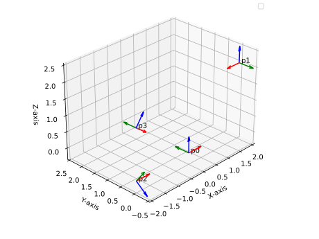
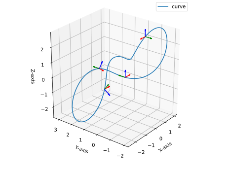
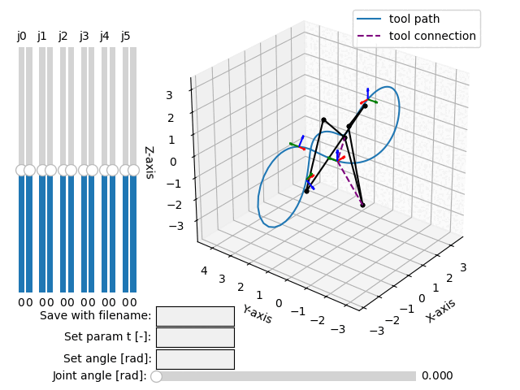
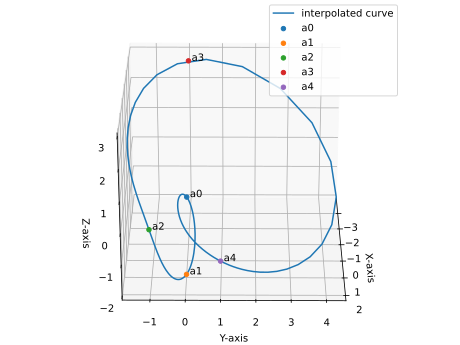
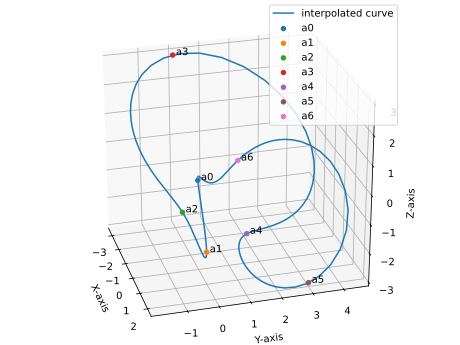

.. _interpolation_examples:

Motion Interpolation
====================

The package implements the method described in the paper by :footcite:t:`Hegeds2015`
for 4 poses interpolation using cubic rational function, that yields
6-revolute linkages, and the method by :footcite:t:`Brunnthaler2005` for
3 poses interpolation using quadratic rational functions, that yields 4-revolute
linkage, i.e. the Bennett mechanism.

The previous methods interpolate poses (trasformations) in 3D space. The method by
:footcite:t:`Zube2018` is interpolating 5 or 7 points in 3D space, and yields
a quadratic or cubic rational function that represents a 4R (Bennett) or
6R linkage.

All methods have some geometrical constraints, and therefore the interpolation is not
always possible. The package is also providing a method for 2 poses
interpolation method that yields a spatial Bennett mechanism (4-revolute linkage).

For motion interpolation, the input can be both, :class:`.DualQuaternion` objects
or :class:`.TransfMatrix` objects.

Quadratic interpolation of 3 poses
----------------------------------

The following example applies the method by :footcite:t:`Brunnthaler2005`.

.. literalinclude:: /examples/d_t_interp_quad3poses.py
    :language: python

Cubic interpolation of 4 poses
------------------------------

This method does not work for any 4 poses - some geometrical constraints must be
met. Please, refer to the original paper (:footcite:t:`Hegeds2015`) for more details,
or see simplified description in :ref:`interpolation_background`.

Here is presented an example of cubic interpolation of 4 poses.

.. literalinclude:: /examples/d_t_interp_cubic4poses.py
    :language: python

The input are 4 dual quaternions, :math:`p_0, p_1, p_2, p_3`, and the output is a
parametric rational curve :math:`C(t)` that interpolates the poses. Keep in mind that
:math:`p_0` is the identity.

    4 given poses.

The curve equation is then of the form:

.. math::

   C(t) =
        \begin{bmatrix}
        t^3 - 0.4375t^2 - 0.171875t, \\
        0.25t^2 - 0.25t - 0.078125, \\
        0.3125t^2 - 0.078125t - 0.0390625, \\
        -0.0625t^2 + 0.109375t - 0.0390625, \\
        0.28125t, \\
        0.125t^2 - 0.125t - 0.0390625, \\
        -t^2 + 0.34375t + 0.078125, \\
        0
        \end{bmatrix}

And can be plotted as shown in the following figure.

    Curve :math:`C(t)` that interpolates the poses.

The curve is then factorized, and the resulting mechanism is plotted.

    6R mechanism whose tool frame (purple link) follows the curve :math:`C(t)`.

.. _changing_bases_interpolation:

Quadratic interpolation of 5 points
-----------------------------------

The following example applies the method by :footcite:t:`Zube2018`. The result is
non-monic polynomial, i.e. the factorized mechanism will be transformed by a static
transformation.

.. literalinclude:: /examples/d_t_interp_quad5points.py
    :language: python

The resulting curve is plotted in the following figure.

    Rational quadratic curve that interpolates 5 points.

Cubic interpolation of 7 points
-------------------------------

The follwoing example applies the extended method by :footcite:t:`Zube2018`
and interpolates 7 points (3D points) with a cubic rational motion. The result is
again non-monic polynomial, i.e. the factorized mechanism will be transformed
by a static transformation.

.. literalinclude:: /examples/d_t_interp_cubic7points.py
    :language: python

The resulting curve is plotted in the following figure.

    Rational cubic curve that interpolates 7 points.

**References**

.. footbibliography::

