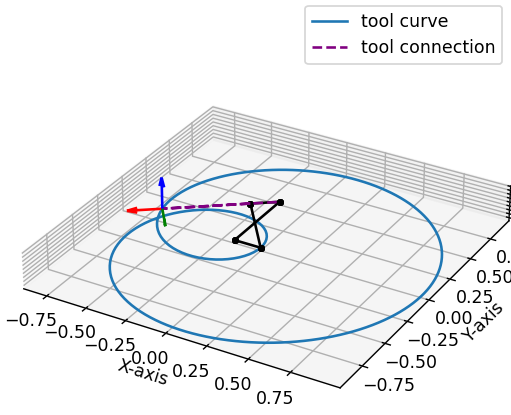
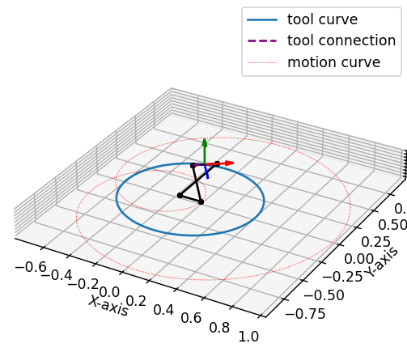
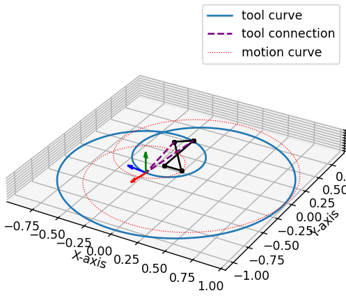

Plotting Examples
=================

The package class :class:`.Plotter` provides a simple interface to plotting rational
mechanisms, and related objects like curves, poses, lines, points, etc.

Static plotting
---------------

By default, the plots are not interactive. This is suitable for simple plots with
static objects:

.. testcode:: [plotting_example1]

    # Plotting static objects

    from rational_linkages import Plotter, DualQuaternion, PointHomogeneous, NormalizedLine, TransfMatrix

    # create plotter object, arg steps says how many descrete steps will be used for
    # plotting curves
    myplt = Plotter()

    # create two DualQuaternion objects
    identity = DualQuaternion()
    pose1 = DualQuaternion([0, 0, 1, 0, 0, -0.5, 1, 0])
    pose2 = TransfMatrix.from_rpy_xyz([0, -90, 0], [0, 0, 0.5], unit='deg')

    # create a point with homogeneous coordinates w = 1, x = 2, y = -3, z = 1.5
    point = PointHomogeneous([1, 2, -3, 1.5])

    # create a normalized line from direction vector and the previously specified point
    line = NormalizedLine.from_direction_and_point([0, 0, 1], point.normalized_in_3d())

    # plot the objects
    # 1-line command
    myplt.plot(identity, label='base')
    myplt.plot(point, label='pt')
    myplt.plot(line, label='l1')
    # or for cycle
    for i, obj in enumerate([pose1, pose2]):
        myplt.plot(obj, label='p{}'.format(i + 1))

    myplt.show()

.. testcleanup:: [plotting_example1]

    del myplt, identity, pose1, pose2, point, line
    del Plotter, DualQuaternion, PointHomogeneous, NormalizedLine, TransfMatrix

Which will result in the following image:

.. figure:: figures/plotting_static.png
    :width: 500 px
    :align: center
    :alt: Output static plot

Interactive plotting
--------------------

In the interactive mode, the mechanisms can be animated.

.. testcode:: [plotting_example2]

    # Interactive plotting with a loaded mechanism model

    from rational_linkages import RationalMechanism, Plotter, PointHomogeneous
    from rational_linkages.models import bennett_ark24

    # load the mechanism
    m = bennett_ark24()

    # create an interactive plotter object
    myplt = Plotter(mechanism=m, steps=500, arrows_length=0.05)

    # create a point with homogeneous coordinates w = 1, x = 0.5, y =  -0.75, z = 0.25
    point = PointHomogeneous([1, 0.5, -0.75, 0.25])

    myplt.plot(point, label='pt')
    myplt.show()

.. testcleanup:: [plotting_example2]

    del myplt, m, point
    del RationalMechanism, Plotter, PointHomogeneous, bennett_ark24

Which will result in the following image:

.. figure:: figures/plotting_interactive.svg
    :width: 500 px
    :align: center
    :alt: Output interactive plot

The interactive plotter can be used to animate the mechanism using the slider widget
bellow the plot. The sliders on the left side of the plot can be used to change the
design parameters of the mechanism.

Scaling of plotted objects
^^^^^^^^^^^^^^^^^^^^^^^^^^

Sometimes, the mechanism is too large or too small to be plotted along with its
tool frame, or the range sliders that control physical realization have very high/low
limits. In such cases, it is possible to use key word arguments ``arrows_length`` and
``joint_sliders_lim`` when initializing the plotter using :class:`.Plotter` class.

The ``joint_sliders_lim`` specifies the limits of the range sliders, and the ``arrows_length``
to adjust the size of the length of the frames/poses that are plotted.

.. testcode:: [plotting_example3]

    # Interactive plotting with a loaded mechanism model, adjusted scaling

    from rational_linkages import Plotter
    from rational_linkages.models import bennett_ark24 as bennett

    m = bennett()

    plt = Plotter(mechanism=m, arrows_length=0.05, joint_sliders_lim=0.5)
    plt.show()

.. testcleanup:: [plotting_example3]

        del plt, m
        del Plotter, bennett

Optional tool frames
^^^^^^^^^^^^^^^^^^^^

When an object :class:`.RationalMechanism` is plotted, an optional argument
``show_tool=True`` can be used to plot its tool frame, as showed in the previous
examples.
However, the tool of a mechanism frame can be handled in three ways:

    1. The tool frame is not specified, i.e. ``None`` -- then, the tool frame
    is attached by two connecting lines to the last link and follows the mechanism's
    motion curve.

    2. The tool frame is specified as string `tool='mid_of_last_link'`, which calculates
    and places the tool frame in the middle of the last link, with x-axis coinciding
    with the link.

    3. The tool frame is specified as :class:`.DualQuaternion` object using argument
    ``tool=DualQuaternion()`` -- then, this tool frame is attached to the last link.

The following examples show the three options.

.. testcode:: [plotting_example4]

    # Tool frame on motion curve

    from rational_linkages import (RationalMechanism, DualQuaternion,
                                   Plotter, MotionFactorization)

    # Define factorizations
    f1 = MotionFactorization([DualQuaternion([0, 0, 0, 1, 0, 0, 0, 0]),
                              DualQuaternion([0, 0, 0, 2, 0, 0, -1, 0])])

    f2 = MotionFactorization([DualQuaternion([0, 0, 0, 2, 0, 0, -1 / 3, 0]),
                              DualQuaternion([0, 0, 0, 1, 0, 0, -2 / 3, 0])])

    # Create mechanism
    m = RationalMechanism([f1, f2])

    # Create plotter
    p = Plotter(mechanism=m, steps=200, arrows_length=0.2)

    # Plot mechanism
    p.show()

.. testcleanup:: [plotting_example4]

    del p, m, f1, f2
    del RationalMechanism, DualQuaternion, Plotter, MotionFactorization

.. testcode:: [plotting_example5]

    # Tool frame in the middle of the last link

    from rational_linkages import (RationalMechanism, DualQuaternion,
                                   Plotter, MotionFactorization)

    # Define factorizations
    f1 = MotionFactorization([DualQuaternion([0, 0, 0, 1, 0, 0, 0, 0]),
                              DualQuaternion([0, 0, 0, 2, 0, 0, -1, 0])])

    f2 = MotionFactorization([DualQuaternion([0, 0, 0, 2, 0, 0, -1 / 3, 0]),
                              DualQuaternion([0, 0, 0, 1, 0, 0, -2 / 3, 0])])

    # Create mechanism
    m = RationalMechanism([f1, f2], tool='mid_of_last_link')

    # Create plotter
    p = Plotter(mechanism=m, steps=200, arrows_length=0.2)

    # Plot the default motion curve
    p.plot(m.get_motion_curve(), label='motion curve', interval='closed',
           color='red', linewidth='0.7', linestyle=':')
    p.show()

.. testcleanup:: [plotting_example5]

    del p, m, f1, f2
    del RationalMechanism, DualQuaternion, Plotter, MotionFactorization

.. testcode:: [plotting_example6]

    # Tool frame specified as DualQuaternion

    from rational_linkages import (RationalMechanism, DualQuaternion, TransfMatrix,
                                   Plotter, MotionFactorization)

    # Define factorizations
    f1 = MotionFactorization([DualQuaternion([0, 0, 0, 1, 0, 0, 0, 0]),
                              DualQuaternion([0, 0, 0, 2, 0, 0, -1, 0])])

    f2 = MotionFactorization([DualQuaternion([0, 0, 0, 2, 0, 0, -1 / 3, 0]),
                              DualQuaternion([0, 0, 0, 1, 0, 0, -2 / 3, 0])])

    # Create tool frame from transformation matrix
    tool_matrix = TransfMatrix.from_rpy_xyz([90, 0, 45], [-0.2, 0.5, 0], unit='deg')
    tool_dq = DualQuaternion(tool_matrix.matrix2dq())

    # Create mechanism
    m = RationalMechanism([f1, f2], tool=tool_dq)

    # Create plotter
    p = Plotter(mechanism=m, steps=200, arrows_length=0.2)

    # Plot the default motion curve
    p.plot(m.get_motion_curve(), label='motion curve', interval='closed',
           color='red', linewidth='0.7', linestyle=':')
    p.show()

.. testcleanup:: [plotting_example6]

    del p, m, f1, f2, tool_matrix, tool_dq
    del RationalMechanism, DualQuaternion, TransfMatrix, Plotter, MotionFactorization

Generating frames for animation
^^^^^^^^^^^^^^^^^^^^^^^^^^^^^^^

It is possible to generate frames for the mechanism using the
method :meth:`.Plotter.animate` which will generate `png` files by default (`pdf`
is an option).