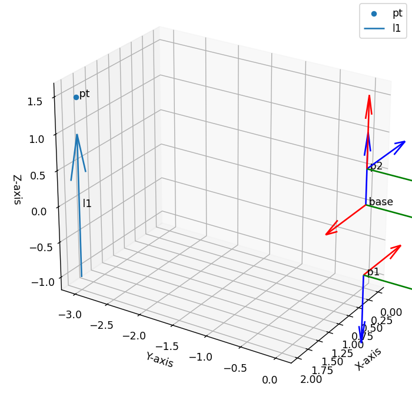
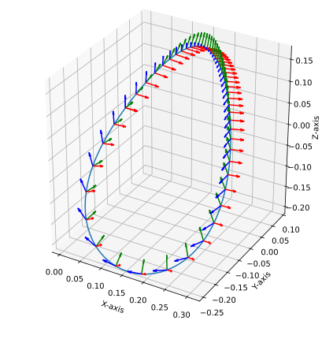
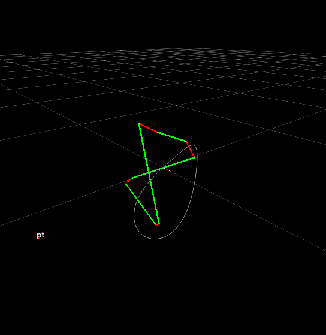
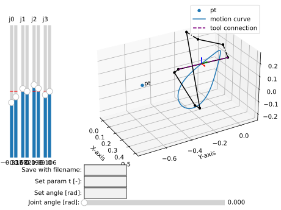
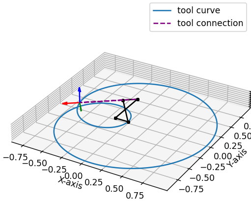
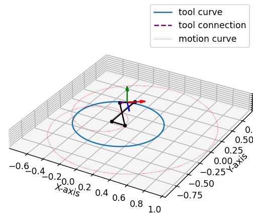
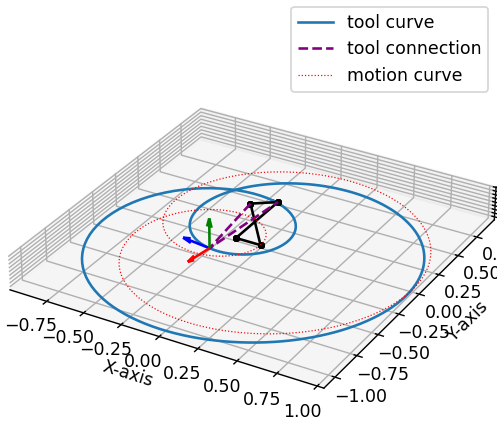

Plotting Examples
=================

The package class :class:`.Plotter` provides a simple interface to plotting rational
mechanisms, and related objects like curves, poses, lines, points, etc.

The :class:`.Plotter` returns either :class:`.PlotterPyqtgraph` or :class:`.PlotterMatplotlib`, as both backends
are supported and share most of the functionality. The default backend is :class:`.PlotterPyqtgraph`, which is
faster and therefore more suitable for interactive plotting. The :class:`.PlotterMatplotlib` is more suitable for
publishing, as it provides better quality and cleanness (thanks to vector graphics) of the output images.

Static plotting
---------------

By default, the plots are not interactive. This is suitable for simple plots with
static objects:

.. literalinclude:: /examples/d_plotting_static.py
    :language: python

Which will result in the following image:

Additionally, it is also possible to plot motion curve of a mechanism.

.. literalinclude:: /examples/d_plotting_motion_curve.py
    :language: python

Which will result in the following image:

Interactive plotting
--------------------

In the interactive mode, the mechanisms can be animated.

.. literalinclude:: /examples/d_plotting_loaded_model.py
    :language: python

Which will result in the following image. The interactive plotter can be used to animate
the mechanism using the slider widget
bellow the plot. The sliders on the left side of the plot can be used to change the
design parameters of the mechanism.

If the argument ``backend='matplotlib'`` is used, the plot will switch to this mode:

Scaling of plotted objects
^^^^^^^^^^^^^^^^^^^^^^^^^^

Sometimes, the mechanism is too large or too small to be plotted along with its
tool frame, or the range sliders that control physical realization have very high/low
limits. In such cases, it is possible to use key word arguments ``arrows_length`` and
``joint_sliders_lim`` when initializing the plotter using :class:`.Plotter` class.

The ``joint_sliders_lim`` specifies the limits of the range sliders, and the ``arrows_length``
to adjust the size of the length of the frames/poses that are plotted.

.. literalinclude:: /examples/d_plotting_interactive_scaling.py
    :language: python

.. _alternative_tools:

Optional tool frames
^^^^^^^^^^^^^^^^^^^^

When an object :class:`.RationalMechanism` is plotted, an optional argument
``show_tool=True`` can be used to plot its tool frame, as showed in the previous
examples.
However, the tool of a mechanism frame can be handled in three ways:

    1. The tool frame is not specified, i.e. ``None`` -- then, the tool frame
    is attached by two connecting lines to the last link and follows the mechanism's
    motion curve.

    2. The tool frame is specified as string `tool='mid_of_last_link'`, which calculates
    and places the tool frame in the middle of the last link, with x-axis coinciding
    with the link.

    3. The tool frame is specified as :class:`.DualQuaternion` object using argument
    ``tool=DualQuaternion()`` -- then, this tool frame is attached to the last link.

The following examples show the three options.

.. literalinclude:: /examples/d_plot_tool1.py
    :language: python

.. literalinclude:: /examples/d_plot_tool2.py
    :language: python

.. literalinclude:: /examples/d_plot_tool3.py
    :language: python

Generating frames (for animation)
^^^^^^^^^^^^^^^^^^^^^^^^^^^^^^^^^

Both classes :class:`.PlotterPyqtgraph` and :class:`.PlotterMatplotlib` have various methods to generate a figure
or set of figures for animation purposes. See for more details the implementation:
:meth:`.PlotterMatplotlib.save_image`, :meth:`.PlotterMatplotlib.animate`, :meth:`.PlotterMatplotlib.animate_angles`,
:meth:`.InteractivePlotterWidget.on_save_figure_box` (use GUI), :meth:`.PlotterPyqtgraph.animate_rotation`.