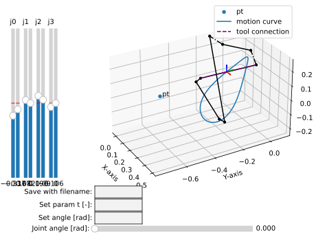

Plotting examples
=================

The package class :class:`.Plotter` provides a simple interface to plotting rational
mechanisms, and related objects like curves, poses, lines, points, etc.

Static plotting
---------------

By default, the plots are not interactive. This is suitable for simple plots with
static objects:

.. code-block:: python
    :caption: Plotting static objects

    from rational_linkages import Plotter, DualQuaternion, PointHomogeneous, NormalizedLine, TransfMatrix

    if __name__ == '__main__':
        # create plotter object, arg steps says how many descrete steps will be used for
        # plotting curves
        myplt = Plotter()

        # create two DualQuaternion objects
        identity = DualQuaternion()
        pose1 = DualQuaternion([0, 0, 1, 0, 0, -0.5, 1, 0])
        pose2 = TransfMatrix.from_rpy_xyz([0, -90, 0], [0, 0, 0.5], units='deg')

        # create a point with homogeneous coordinates w = 1, x = 2, y = -3, z = 1.5
        point = PointHomogeneous([1, 2, -3, 1.5])

        # create a normalized line from direction vector and the previously specified point
        line = NormalizedLine.from_direction_and_point([0, 0, 1], point.normalized_in_3d())

        # plot the objects
        # 1-line command
        myplt.plot(identity, label='base')
        myplt.plot(point, label='pt')
        myplt.plot(line, label='l1')
        # or for cycle
        for i, obj in enumerate([pose1, pose2]):
            myplt.plot(obj, label='p{}'.format(i + 1))

        myplt.show()

Which will result in the following image:

Interactive plotting
--------------------

In the interactive mode, the mechanisms can be animated.

.. code-block:: python
        :caption: Interactive plotting with a loaded mechanism model

        from rational_linkages import RationalMechanism, Plotter
        from rational_linkages.models import bennett_ark24

        if __name__ == '__main__':
            # load the mechanism
            m = bennett_ark24()

            # create an interactive plotter object
            myplt = Plotter(interactive=True, steps=500, arrows_length=0.05)

            # create a point with homogeneous coordinates w = 1, x = 2, y = -3, z = 1.5
            point = PointHomogeneous([1, 0.5, -0.75, 0.25])

            myplt.plot(point, label='pt')
            myplt.plot(m, show_tool=True)
            myplt.show()

Which will result in the following image:

The interactive plotter can be used to animate the mechanism using the slider widget
bellow the plot. The sliders on the left side of the plot can be used to change the
design parameters of the mechanism.